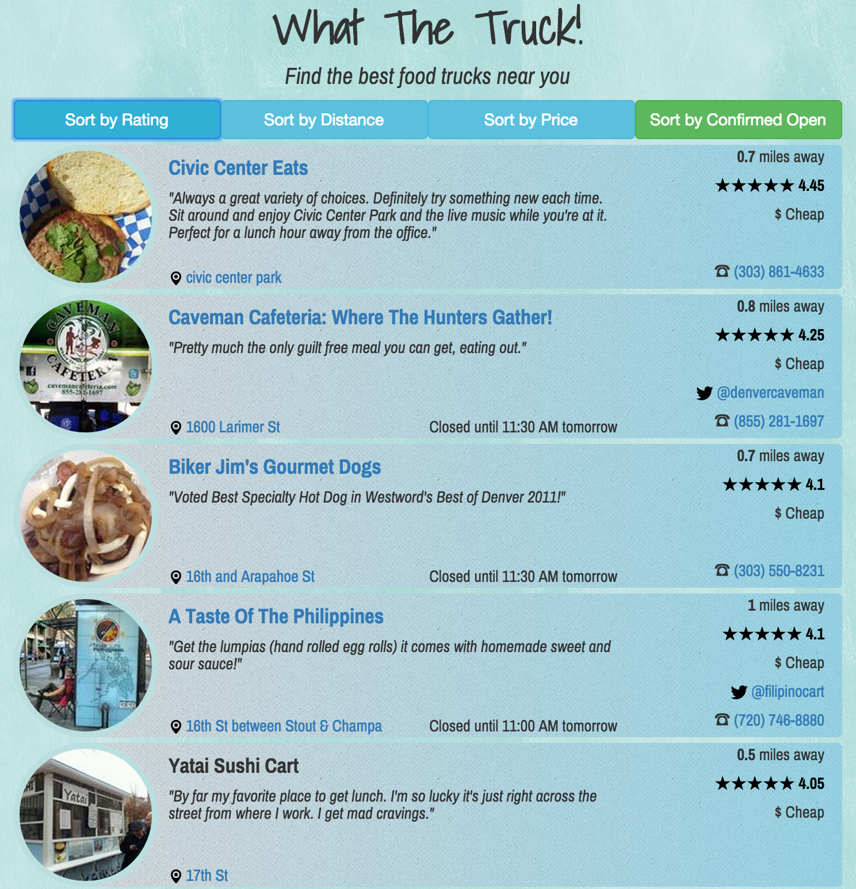

#What The Truck!

##Purpose
To create a simple UI that displays intuitive, real-time information for food trucks.

##Features
1. Real-time, relevant consumer data
1. Minimal and easy-to-read UI
1. Fair and relative rating system derived from Foursquare's 1-10 system
1. Random user comments. Emphasis on *random*

##Technologies
1. HTML5
1. Bootstrap
1. Functional JavaScript
1. jQuery
1. JSON/AJAX
1. Foursquare API
1. ~~*possibly* Twitter API~~

##Constraints
1. Quality & limits of API data
1. ~~Alternative solutions~~

##Procedure for project
1. ~~Learn Foursquare API~~
1. ~~If not sufficient, look at Twitter API~~
1. ~~Define what information will be needed to track trucks~~
1. ~~Optimize UI to continually compliment live API data~~
1. ~~Test information & results~~
1. ~~Create responsive bootstrap layout.~~
1. Fix lazy & shitty css
1. Beautify

##Stretch Goals
1. Make platform API agnostic so I can:
1. Cross-reference data between APIs and return the most relevant data from a given source; i.e., Yelp, Google Places, etc
1. Geolocation. Not really a stretch
1. Optimize for touch-screen devices
1. g[11] rating system
